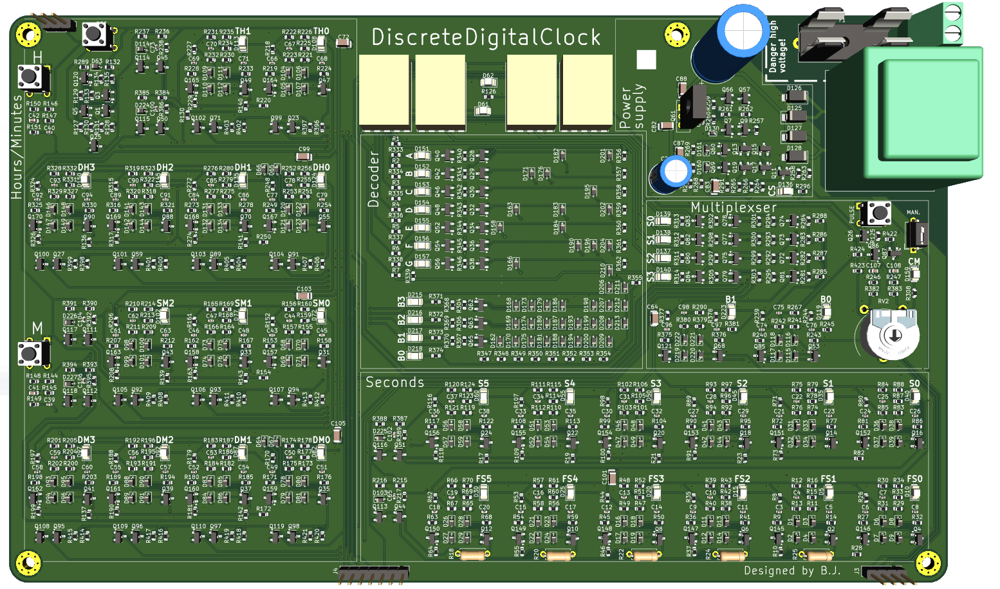

# DDC Manual – Project Overview

Welcome! 👋  
This is the GitHub repository for my **DDC Manual**:  
📖 A web-based manual and documentation page for my **Digital Display Clock (DDC)** project.

🔗 **Live Manual:** [blazjerman.github.io/DDC-Manual](https://blazjerman.github.io/DDC-Manual/)

---

## 📖 About This Page

This page serves as the official manual and visual guide for the DDC — a custom-built digital display clock. The DDC Manual provides technical details, images, and schematics related to the project.

Here you can:
- Learn about the DDC’s design and functionality.
- Explore internal schematics and how the circuit is wired.
- View photos of the final physical build.
- Understand the layout and structure of the renderer.
- Use the manual as a reference for your own builds or modifications.

---

## 📁 Repository Contents

This GitHub repository includes everything shown on the manual website:

- `/index.html` – The main landing page of the DDC Manual.
- `/files/` – Contains useful documentation and project files like:
  - `DDC_Schematic.pdf` – The complete schematic of the clock.
  - `DDC_BOM.xlsx` – Bill of materials, if provided.
- `/images/` – Contains pictures and renderings of the DDC project:
  - Photos of the assembled clock.
  - PCB layout screenshots.
  - 3D model renders of the design.
- `/css/` – Styling for the site (if used for custom layout).

---

## 🖼️ Preview

Here’s a quick look at the 3D render of the DDC design:

> *Render of DDC*

---

## 🪪 License

**DDC (Discrete Digital Clock) © 2025 Blaž Jerman**  
Licensed under [Creative Commons Attribution-NonCommercial 4.0 International (CC BY-NC 4.0)](https://creativecommons.org/licenses/by-nc/4.0/)

---
