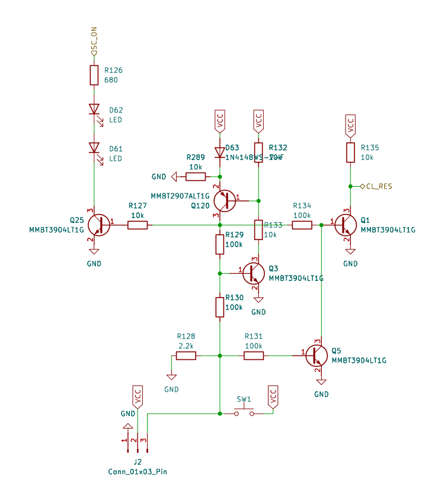

This section provides a detailed explanation of the clock’s operation. It is recommended for users who already have a basic understanding of electronics and some knowledge of transistors.

The clock includes many LED indicators to show how the system works (details about LED functions are provided below). The indicator LEDs operate at low current to increase their lifespan—most run at 2 mA, except for the display LEDs, which are driven at around 15 mA due to multiplexing and their lower brightness.

All other components on the board are high quality. All ceramic capacitors are C0G type from Murata Electronics, and the transistors and diodes are sourced from ON Semiconductor.

The clock board is divided into different chambers, each labeled by name and representing a specific functional section. There are five labeled chambers:

- Power Supply  
- Seconds  
- Hours / Minutes  
- Decoder  
- Multiplexer  

You can find the full schematic of the clock here:  
[📄 View Clock Schematic (PDF)](/files/scheme.pdf)

Below is a detailed description of each chamber.

### Power Supply

The power supply takes mains AC and converts it to a lower 6V using a transformer. A fuse is included on the primary side for safety. If a socket transformer is used, you should install a 1A fuse and short transformer pins 1 to 7 and 5 to 9. This allows you to connect the low-voltage wires from the socket to the top-right connector.

The transformer output is then rectified and regulated down to 6V using a low-voltage drop-down regulator. This regulator includes a comparator that compares a reference voltage from a 3V Zener diode to control the output. A BD140 transistor is used for voltage regulation. This transistor is rated to dissipate 1.25W without a heat sink; while a heat sink can be added, it is not required in this case.

On the right side, there is a Schmitt trigger comparator that receives the mains frequency signal and filters out unwanted noise that may come from other devices on the same power network. There is also an LED indicator labeled R296 (marked "CS" on the board), which blinks at the mains frequency.

### Seconds

This part of the clock converts the mains frequency into seconds, and then into minutes. It is made up of counters and reset counters.

Each counter is a toggle flip-flop with two output states: a normal STATE and its negation. It has a RESET input, which sets it to its initial state when high, and a PULSE input, which toggles its state on the falling edge of the pulse.

The reset counter is a simple pulse extender that outputs high when the input is low. It also includes a reset input that forces the output high, allowing the clock to be reset.

The entire section consists of 12 counters and two reset counters. The first six counters, located at the bottom, convert the mains frequency into seconds. These counters are connected in series: the first receives a noise-free mains frequency signal from the power supply at its pulse input; each of the remaining five counters is connected via the negated output of the previous counter to its own pulse input. Each counter also has an LED that lights up when its STATE output is high, allowing us to visually read the binary value. This design makes the clock digital, with each counter representing one bit of a binary number—in this case, a 6-bit number, with the least significant bit on the right (FS0) and the most significant on the left (FS5). The binary value can be easily converted to decimal by reading the LEDs.

A 6-bit counter can represent 64 values (0 to 63), but we need it to count only up to the mains frequency (e.g., 50Hz) in order to generate a 1-second pulse at the final counter. To achieve this, a reset counter resets the six counters once they reach a specific value. For example, if we want the counters to reset at 50 (binary 110010), we must detect that exact value and then pull all the reset inputs of the six counters high. The simplest way to detect this number is by using an OR logic gate on all the outputs that should be low at the reset point. This outputs high whenever the value is not the target, and low only when the exact reset value is reached. The resulting pulse is then inverted and extended by the reset counter to ensure a safe and reliable reset.

This reset method has a minor issue: due to transistor delays, the reset value might briefly appear for a few nanoseconds. This is not visible to the naked eye but can be detected using a high-speed camera. The main advantage of this design is that the same reset logic can be used for all counters that need to reset at a specific value.

The second group of six counters converts seconds into minutes. They function similarly to the first group, but are fixed to reset at 60 (binary 111100). Technically, with a 50Hz mains frequency, all 12 counters could be linked and reset together at a count of 300. However, this would make it difficult to visually convert the binary seconds into decimal using the LEDs from S0 to S5.

### Hours / Minutes

The hours and minutes parts of a clock work similarly to second counters, using the same method for resetting. The 24-hour digit has additional logic for resetting, but it still follows the same style as the other counter resets. Additionally, there is a block of logic called bus_enable which, when ENABLE is high, connects IN to OUT. OUT is then connected to the correct bit in a 4-bit bus.

The bus is 4-bit and is used, with the help of a multiplexer and decoder, to convert each binary digit of the hours and minutes into decimal form for display. For simplicity, the bus uses an open-drain approach.

There are also two increment counter logics for setting the minutes and hours. They function in the same way as the counter PULSE.

This part of the circuit is responsible for resetting all the clock counters. It will also trigger a reset if the voltage drops too low for the clock to operate properly.

When the clock is powered on, the flip-flop starts in the OFF state. It will remain OFF until the RESET button (SW1) is pressed. Transistor Q5 ensures that once the button is pressed, the flip-flop stays in the OFF state even if the button is not released immediately. This allows the clock to be precisely reset, setting all counters to 0.

LEDs D62 and D61 act as dividers between numbers. They remain off when the clock is in a state that requires a reset.

### Decoder

The decoder’s purpose is to convert a binary number into the corresponding decimal digit and drive a 7-segment display accordingly. The binary input to the decoder is represented by LEDs labeled B0 to B3, which are connected to a 4-bit bus. The output can be seen on the display or on LEDs labeled A to G.

This decoder is similar in concept to a typical diode matrix found in other projects but is designed differently and optimized for space. The lower diode matrix receives a 4-bit bus input. Normally, this type of matrix converts binary input into all possible output states. For decimal display, 10 states (0 to 9) are required, with only one output line active (high) at any given time.

In standard designs, this output is usually inverted and passed to a second diode matrix to activate the correct segments of the display. In this design, inversion is not applied after the first matrix; instead, it is applied after the second diode matrix. This approach reduces both transistor and diode counts and avoids the voltage drop that would otherwise occur after the first matrix. The voltage drop is instead negated within the second matrix.

Due to this change, the second matrix is inverted first, allowing for further reduction in diode count. Certain digit patterns also allowed for simplification, enabling the removal of some diodes entirely. Additionally, a few diodes that are not essential for full 10-state decoding were omitted. With all these optimizations, the overall component count was reduced by approximately 50 elements.

Further simplification using transistor logic is possible, but this was avoided to maintain clarity and manageability of the design.

### Multiplexer

The multiplexer controls which counter is connected to the decoder at any given moment, allowing the correct 7-segment display to be activated in a time-multiplexed manner. We have four 7-segment displays: two for hours and two for minutes. This means each display can be active for most 1/4 of the time.

To cycle through the four display states, we can use a similar approach to the diode matrix used in the decoder, which involved two counters. However, due to the low number of states required, we can simplify this using just resistors.

A clock signal is also needed to drive the multiplexer. For this, we use a simple bistable multivibrator oscillator running at approximately 300 Hz. It includes a potentiometer to adjust the duty cycle (on/off ratio), which allows us to control the brightness of the digits. The duty cycle can be set anywhere from 10% (dim) to 90% (bright).

A manual switch (SW6, labeled "MAN") is also included to disable the multiplexer clock. In this mode, a button labeled "PULSE" (SW7) allows manual advancement of the multiplexer for testing purposes. LEDs labeled S0 to S3 indicate the current selected state, with S0 representing decimal seconds and S3 representing the ternary hour.

This part is the biggest difference between this clock and other similar projects. Because of this, and the previously described optimizations, it uses significantly fewer components than the others.

### Additional Connections

This section provides a brief overview of the available expansion headers.

At the bottom of the board, there are two headers reserved for connecting optional add-ons or custom modules.

#### Left Header (J4 – 7 Pins)

- **Pins 1–4:** A 4-bit bus, with the **least significant bit on the left**.  
- **Pin 5:** A **reset-needed** signal, which goes high when the clock needs to be reset.  
- **Pin 6:** **Power (6 V)**.  
- **Pin 7:** **Ground**.

#### Right Header – 4 Pins

- **Pins 1–2:** A 2-bit binary value representing the current multiplexer state (i.e., which digit is selected).  
- **Pin 3:** A **PWM signal**, which can be used for brightness control or other timing-based functions.  
- **Pin 4:** **Ground**.

### Board and components

  
*pcb*

The PCB is blue, two-layered, and 1.6 mm thick. All components, including the board, are RoHS-compliant and of high quality. The back plate is made entirely of copper for shielding, except in areas with high voltage.

#### Components List

| Part Type       | Value         | Company           | Qty |
|-----------------|---------------|-------------------|-----|
| Capacitor_THT   | 470μ          | Philips           | 1   |
| Capacitor_SMD   | 220p          | Murata Electronics| 90  |
| Capacitor_SMD   | 10n           | Murata Electronics| 4   |
| Capacitor_SMD   | 0.1μ          | Murata Electronics| 10  |
| Capacitor_THT   | 3300μ         | Philips           | 1   |
| Diode_SMD       | 1N4148WS-7-F  | Diodes Incorporated|160 |
| LED_SMD         | LED           | LiteOn            | 46  |
| Diode_SMD       | S1A-13-F      | Diodes Incorporated|4   |
| Diode_SMD       | 3V            | Diodes Incorporated|1   |
| Fuse            | Fuse          | Schurter          | 1   |
| 7 Segment Display| SA52-11EWA   | Kingbright        | 4   |
| Transistor_SMD  | MMBT3904LT1G  | Onsemi            | 116 |
| Transistor_SMD  | MMBT2907ALT1G | Onsemi            | 24  |
| Transistor_THT  | BD140-16      | -                 | 1   |
| Resistor_SMD    | 220           | -                 | 7   |
| Resistor_SMD    | 10k           | -                 | 109 |
| Resistor_SMD    | 100k          | -                 | 219 |
| Resistor_SMD    | 2.2k          | -                 | 48  |
| Resistor_THT    | 100k          | -                 | 2   |
| Resistor_SMD    | 33k           | -                 | 13  |
| Resistor_SMD    | 680           | -                 | 1   |
| Resistor_SMD    | 4.7k          | -                 | 10  |
| Resistor_SMD    | 470           | -                 | 2   |
| Resistor_SMD    | 47k           | -                 | 3   |
| Potentiometer_THT| 250k         | Piher             | 1   |
| Button_Switch_THT| Push         | Omron             | 4   |
| Button_Switch_THT| N_CLOSED     | -                 | 1   |
| Transformer_THT | 1P_1S         | HAHN              | 1   |