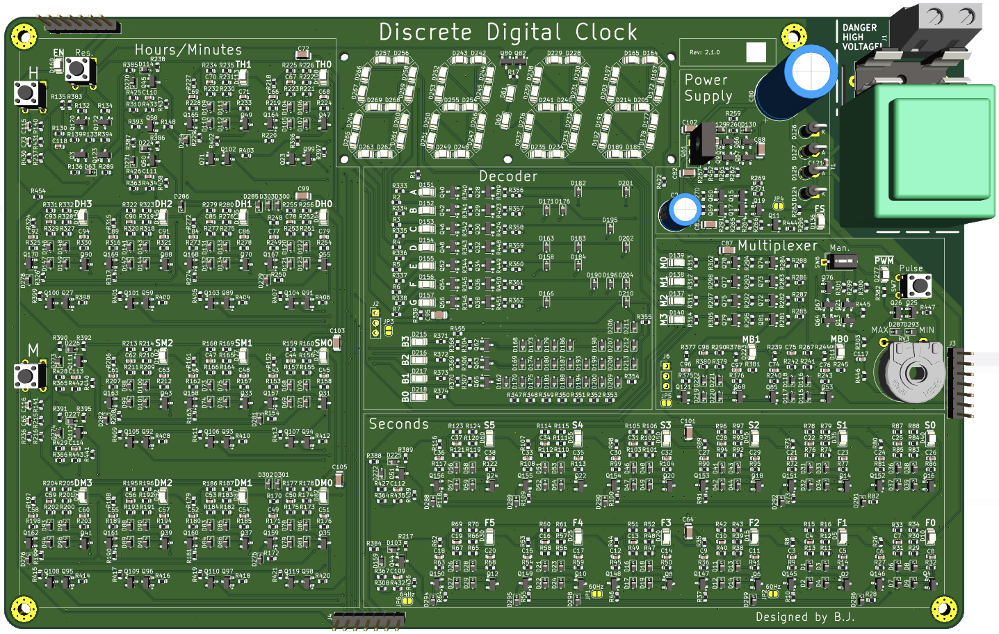
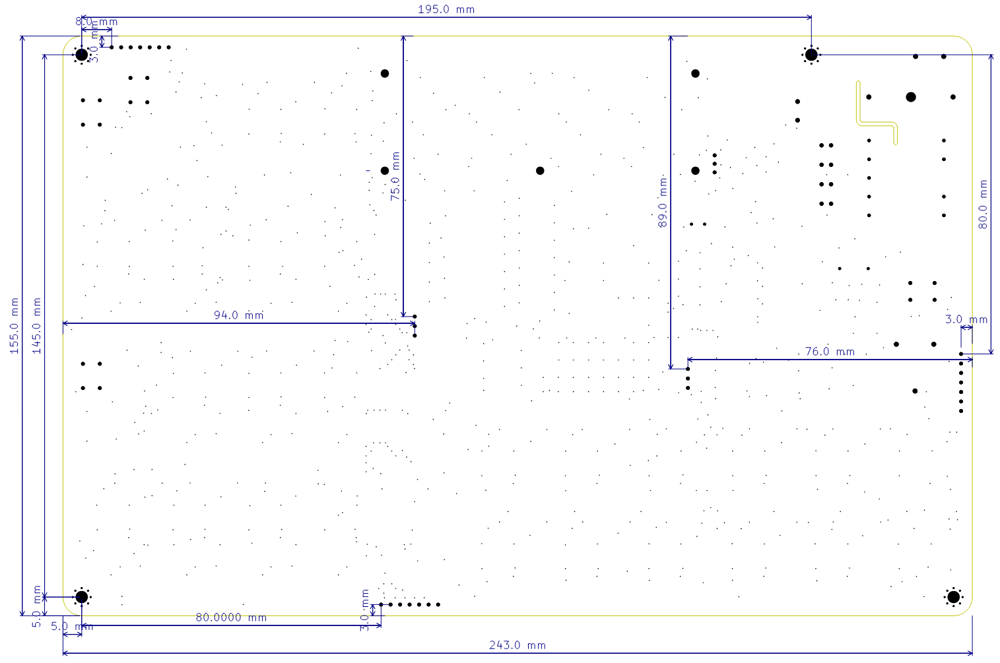

# Discrete Digital Clock

*The complete Discrete Digital Clock PCB, showing the display, counter LEDs, power supply, controls, and discrete logic.*

## Introduction

This clock is an enlarged version of a logic IC, designed entirely from discrete components. It’s a fascinating way to see what’s inside a typical clock counter IC. The design is optimized for discrete components and simplified to use a relatively small number of parts.

The clock has four 7-segment displays that show a 24-hour time format with minutes. It also includes indicator LEDs for all counters, allowing you to see the binary values of hours, minutes, and seconds.

What makes this clock especially interesting is that it uses only basic components transistors, resistors, diodes, and LEDs. No microcontrollers or integrated circuits are involved. In fact, this clock could have been built as early as 1970, using only the technology available at that time.

All components used are **high quality and RoHS-compliant**, ensuring safety and durability. The **expected lifetime is extremely long** for nearly all parts except for the electrolytic capacitors, which may eventually require replacement after many years. Fortunately, these are easy to identify and replace if needed.

Another major advantage of this design is **visibility**: thanks to the widespread use of LEDs throughout the circuit, problems are easy to spot and diagnose. If something fails, you can typically see exactly where the issue is and fix it quickly.

The clock is meant for people who are interested in electronics enthusiasts who don’t take ICs for granted. It’s also great for those learning electronics or anyone who simply likes how it looks.

This project started during the COVID lockdowns, when I had a lot of free time and decided to design my own transistor based clock. That first version worked poorly and wasn’t very reliable. A couple of years later, I revisited the project and improved it significantly.

The clock’s precision depends on your local electric grid frequency, and is usually accurate to within ±20 seconds per year. Since it relies on mains frequency, it resets when the power goes out. This approach simplifies the design and reduces the component count. The fewer the components, the fewer things that can fail over time.

The clock is built on an 243 × 155 mm PCB that contains all necessary components. Surface mount (SMD) components are used to reduce soldering time and manufacturing cost. While it would definitely look cooler with through-hole (THT) parts, that would double the size and take much longer to assemble.

The default version supports 230V 50Hz input. There is also an option without a transformer, allowing you to solder your own for other voltages and frequencies (check the [Installation](#installation) section).  
If you're not comfortable working with mains voltage, you can use a socket transformer instead.

There are other similar digital clock kits online, often sold in THT form, but they aren’t optimized for discrete components. This design uses around 900 components, while others typically use between 1200 and 1800. Links to similar projects are provided at the end.

You can mount this clock on a wall using 3M screws, which can be attached to a wooden plate or other surface and then hung.

  
*Rendered image of the Discrete Digital Clock*

For a more detailed preview of the clock internals, see the [Overview](overview.md).

---

## Installation

⚠️ Installation is straightforward, but **use caution**, especially when working with the mains-powered version. ⚠️

### 230V 50Hz Transformer Version

If you're using the mains powered version, you **must have a basic understanding of mains electricity**, as it can be **lethal**. It's essential to **isolate the mains section** of the clock (or the entire unit) to ensure safety. This version is intended for use in Europe and other regions that use 230V 50Hz power.

You will need to provide your own power cable. Connect the cable to the **top right side** of the clock, where the power supply connector is located.

A **30mA fuse** is included with the mains version for added protection.

---

### No Transformer Version

This version does not include a fuse or transformer, so you’ll need to purchase a PCB-mounted transformer separately, rated for your local voltage and frequency.  
If you're not comfortable working with high voltage, you can instead use a plug-in (socket) transformer.

The transformer must be rated for **6V AC** and capable of supplying at least **1.9VA**.  
It’s recommended to use a **60mA fuse on the primary side** for 110V, or a **1A fuse on the secondary side**.

You also need to bridge the bottom jumpers in the minutes section to set the frequency to 60 Hz.

---

### Size

The PCB measures **243 × 155 mm** and features **M3 mounting holes** for easy installation in enclosures or setups.

Below is a dimensioned drawing showing the main sizes of the PCB:

---

## How to Use

When you power on the clock for the first time, it will be set to **00:00** without the colon (`:`) illuminated between the digits. All the counters will show zero and will not begin counting.

To activate the clock, you need to **press the Reset button**. This feature lets you know when a power outage has occurred, as the clock will remain at 00:00 until manually reset.

You can set the time using the following buttons:
- **M** (bottom left) to set **minutes**
- **H** (top left) to set **hours**

To set the seconds accurately, press the **Reset** button and release it **exactly at 0 seconds** (e.g., using another clock or stopwatch as reference).

Pin headers J5 can be used to attach an external MCU or similar device to set the clock automatically. (check Additional Connections in [Overview](overview.md))

---

## Connectivity / Add-ons

The clock has several connector pin headers. You can refer to the pinout diagram in the [Overview](overview.md) to identify each pin.

These connectors can be used to expand the clock’s functionality with features such as an alarm, day/date/year display, stopwatch, and more.

You can also connect the clock’s control pins to a microcontroller, such as an ESP32, so the clock can be automatically set every time it resets.

Add-ons can be found in the [addons](https://github.com/blazjerman/DDC-Manual/tree/main/addons) folder.

---

## Similar Discrete Clock Projects

There are several other discrete clock projects, but most of them use a different design philosophy. The DDC was designed to be compact, stable, self-contained, and practical, while still showing the internal logic of a clock built from individual components.

| Project | Approximate component count | Notes |
|---|---:|---|
| [KABtronics Transistor Clock](https://www.transistor-clock.com/) | 1247 discrete components | 194 transistors, 566 diodes, 400 resistors, 87 capacitors; large THT kit |
| [Mega Transistor Clock](https://mtc.mekweb.eu/) | 1630 parts | 596 diodes and 221 transistors; very large six-digit clock |
| [Techno Logic Art “The Clock”](https://techno-logic-art.com/clock.htm) | 1916 parts | Artistic 3D hand-soldered construction, not PCB based |
| [Transistor Logic Clock MkIII](https://transistorlogicclock.weebly.com/mkiii.html) | 1,440 discrete components | Very low-power transistor clock |
| [Ted Yapo’s Diode Clock](https://hackaday.io/project/11677-the-diode-clock) | 8000+ discrete components | Diode-diode logic clock, much larger and more complex |
| [Fernekes All Transistor Clock](https://www.fernekes.com/2020/04/all-transistor-clock/) | 600+ discrete components | Uses analog divider techniques and separate modules, more of an educational/art project |

The main difference is size and integration. The DDC is much more compact than most similar clocks, and all required components are on a single PCB, including the transformer, fuse, power supply, logic, display drivers, controls, reset circuit, indicator LEDs, and display. Because the clock uses SMD components, the board can be assembled by machine, so no manual soldering is needed for the main PCB. Even with SMD parts, it still looks visually interesting because the logic layout, indicator LEDs, and display remain visible. Many other projects are larger, use separate modules, require more wiring, or need a large amount of hand soldering.

Component count is also important. The DDC uses about 900 components, which is fewer than many similar clocks. Without indicator LEDs and overkill protection diodes, it has fewer than 700 components. The KABtronics clock has over 1,200 listed parts, Techno Logic Art’s clock has 1,916 parts, and Ted Yapo’s Diode Clock has more than 8,000 components.

The DDC uses SMD parts instead of through-hole parts. Through-hole parts are easier to see and look more “classic,” but they make the board much larger and require much more soldering. With SMD, the DDC can stay compact while still keeping the internal logic visible using indicator LEDs.

Stability is another major difference. The DDC is stable because of its onboard power supply circuit, compact SMD layout, and stronger binary reset logic. The shorter PCB traces made possible by SMD components reduce unwanted noise pickup, stray capacitance, and interference compared with larger through-hole layouts. The reset circuit is also more robust than simpler reset approaches used in some other discrete clocks, which helps the counters return reliably to the correct state.

The DDC can technically consume more power than very low power designs such as the Transistor Logic Clock MkIII, but most of that extra current is used by the indicator LEDs and the bright display. The indicator LEDs are driven at about 2 mA, and the 7-segment display segments are driven at about 15 mA. The logic itself consumes a similar amount of power to lower power transistor designs. Compared with very large discrete clocks, the DDC still needs only a fraction of the power.

The Fernekes All Transistor Clock is different from the others because it uses analog divider techniques. This makes it very interesting as an educational design, but it is not expected to be as reliable or stable as fully digital counter based clocks. Analog divider circuits depend more on component tolerances, adjustment, and drift, while digital binary counters are more predictable.

Overall, the DDC is not trying to be the largest, the most artistic, or the absolute lowest power discrete clock. It is designed as a balanced practical clock: compact, stable, self contained, bright, readable, easier to troubleshoot, and much smaller than most comparable fully discrete designs.

---

## More Photos and Videos

More photos and videos can be found in the [Gallery](pictures.md).

