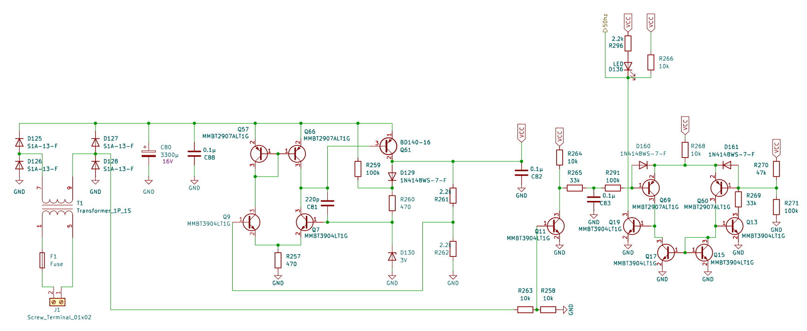

---

## Overview

This clock is an enlarged version of logic IC, designed entirely from discrete components. It’s a cool way to see what’s inside a typical clock counter IC. The design is optimized for discrete components and extremely simplified to use a relatively small number of parts.

What makes this clock especially interesting is that it only uses **basic components**—transistors, resistors, diodes, and LEDs. No microcontrollers or ICs are involved. In fact, this clock could have been built as early as **1970**, using only the technology available at the time.

All components used are **high-quality and RoHS-compliant**, ensuring safety and durability. The **expected lifetime is extremely long** for nearly all parts—except for the **electrolytic capacitors**, which may eventually require replacement after many years. Fortunately, these are easy to identify and replace if needed.

Another major advantage of this design is **visibility**: thanks to the widespread use of LEDs throughout the circuit, problems are easy to spot and diagnose. If something fails, you can typically see exactly where the issue is and fix it quickly.

The clock is meant for people who are interested in electronics—enthusiasts who don’t take ICs for granted. It’s also great for those learning electronics or anyone who simply likes how it looks.

This project started during the COVID lockdowns, when I had a lot of free time and decided to design my own transistor-based clock. That first version worked poorly and wasn’t very reliable. A couple of years later, I revisited the project and improved it significantly.

The clock’s precision depends on your local electric grid frequency, and is usually accurate to within ±20 seconds per year. Since it relies on mains frequency, it resets when the power goes out. This approach simplifies the design and reduces the component count. The fewer the components, the fewer things that can fail over time.

The clock is built on an 243 × 147 mm PCB that contains all necessary components. Surface-mount (SMD) components are used to reduce soldering time and manufacturing cost. While it would definitely look cooler with through-hole (THT) parts, that would double the size and take much longer to assemble.

The default version supports 220V 50Hz input. There is also an option without a transformer, allowing you to solder your own for other voltages and frequencies (check the [Installation](#installation) section).  
If you're not comfortable working with mains voltage, you can use a socket transformer instead.

There are other similar digital clock kits online, often sold in THT form, but they aren’t optimized for discrete components. This design uses around 800 components, while others typically use between 1200 and 1800. Links to similar projects are provided at the end.

You can mount this clock on a wall using the four included 3M screws, which can be attached to a wooden plate or other surface and then hung.

---

## Preview
 
The clock includes many LED indicators to show how the system works (details about LED functions are provided below). The indicator LEDs operate at low current to increase their lifespan—most run at 2 mA, except for the display LEDs, which are driven at around 15 mA due to multiplexing and their lower brightness.

All other components on the board are high quality. All ceramic capacitors are C0G type from Murata Electronics, and the transistors and diodes are sourced from ON Semiconductor.

The clock board is divided into different chambers, each labeled by name and representing a specific functional section. There are five labeled chambers:

- Power Supply  
- Seconds  
- Hours / Minutes  
- Decoder  
- Multiplexer  

  
*Rendered image of the Discrete Digital Clock*

You can find the full schematic of the clock here:  
[📄 View Clock Schematic (PDF)](/files/scheme.pdf)

Below is a detailed description of each chamber.

> Click on each title below to expand and see more details.

Power Supply

The power supply takes mains AC and converts it to a lower 6V using a transformer. A fuse is included on the primary side for safety. If a socket transformer is used, you should install a 1A fuse and short transformer pins 1 to 7 and 5 to 9. This allows you to connect the low-voltage wires from the socket to the top-right connector.

The transformer output is then rectified and regulated down to 6V using a low-voltage drop-down regulator. This regulator includes a comparator that compares a reference voltage from a 3V Zener diode to control the output. A BD140 transistor is used for voltage regulation. This transistor is rated to dissipate 1.25W without a heat sink; while a heat sink can be added, it is not required in this case.

On the right side, there is a Schmitt trigger comparator that receives the mains frequency signal and filters out unwanted noise that may come from other devices on the same power network. There is also an LED indicator labeled R296 (marked "CS" on the board), which blinks at the mains frequency.

Seconds

*Description coming soon...*

Hours / Minutes

*Description coming soon...*

Decoder

*Description coming soon...*

Multiplexer

*Description coming soon...*

---

## Installation

⚠️ Installation is straightforward, but **use caution**, especially when working with the mains-powered version. ⚠️

### 220V 50Hz Transformer Version

If you're using the mains-powered version, you **must have a basic understanding of mains electricity**, as it can be **lethal**. It's essential to **isolate the mains section** of the clock (or the entire unit) to ensure safety. This version is intended for use in Europe and other regions that use 220V 50Hz power.

You will need to provide your own power cable. Connect the cable to the **top right side** of the clock, where the power supply connector is located.

A **30mA fuse** is included with the mains version for added protection.

---

### No Transformer Version

This version does not include a fuse or transformer, so you’ll need to purchase a PCB-mounted transformer separately, rated for your local voltage and frequency.  
If you're not comfortable working with high voltage, you can instead use a plug-in (socket) transformer.

The transformer must be rated for **6V AC** and capable of supplying at least **1.9VA**.  
It’s recommended to use a **60mA fuse on the primary side** for 110V, or a **1A fuse on the secondary side**.

You also need to add resistors to the bottom counters of the minutes section to set the correct frequency.

---

### Size

The PCB measures **243 × 147 mm** and features **M3 mounting holes** for easy installation in enclosures or setups.

Below is a dimensioned drawing showing the main sizes of the PCB:

---

## How to Use

When you power on the clock for the first time, it will be set to **00:00** without the colon (`:`) illuminated between the digits. All the counters will show zero and will not begin counting.

To activate the clock, you need to **press the Reset button**. This feature lets you know when a power outage has occurred, as the clock will remain at 00:00 until manually reset.

You can set the time using the following buttons:
- **M** (bottom left) to set **minutes**
- **H** (top left) to set **hours**

To set the seconds accurately, press the **Reset** button and release it **exactly at 0 seconds** (e.g., using another clock or stopwatch as reference).

---

## Connectivity / Add-ons

The clock has two connectors at the bottom that provide access to the time signal and PWM output for the display. You can refer to the pinout diagram above to identify each pin.

These connectors can also be used to expand the clock’s functionality with features such as an alarm, day/date/year display, stopwatch, and more.

You can also connect buttons to a microcontroller like an ESP32, so the clock can be automatically set up every time it resets.

---

## 📩 Contact

---
