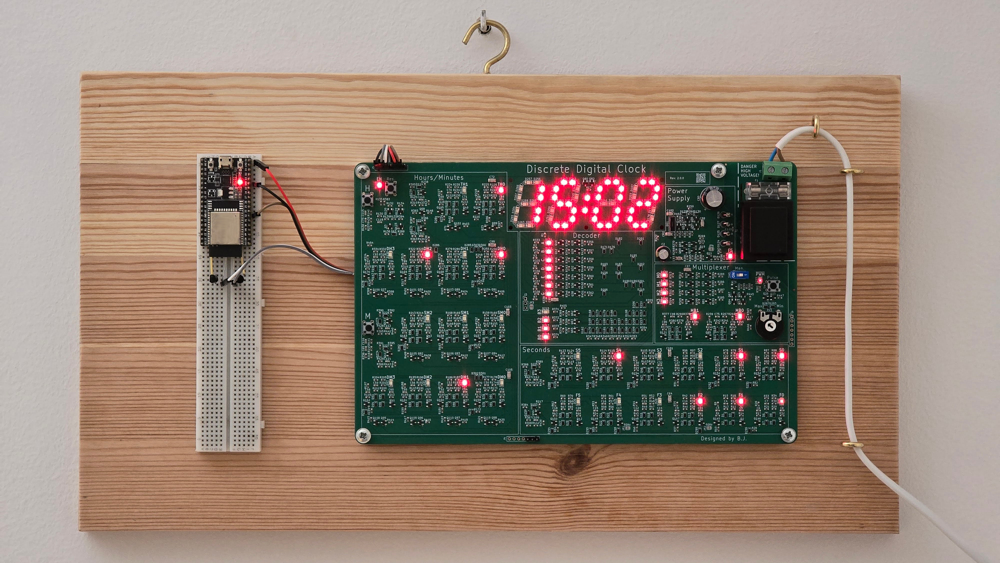
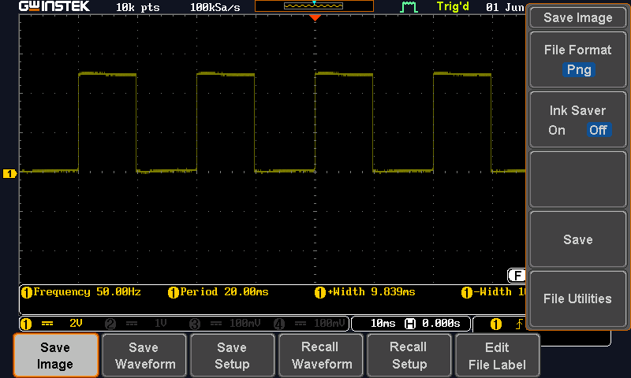
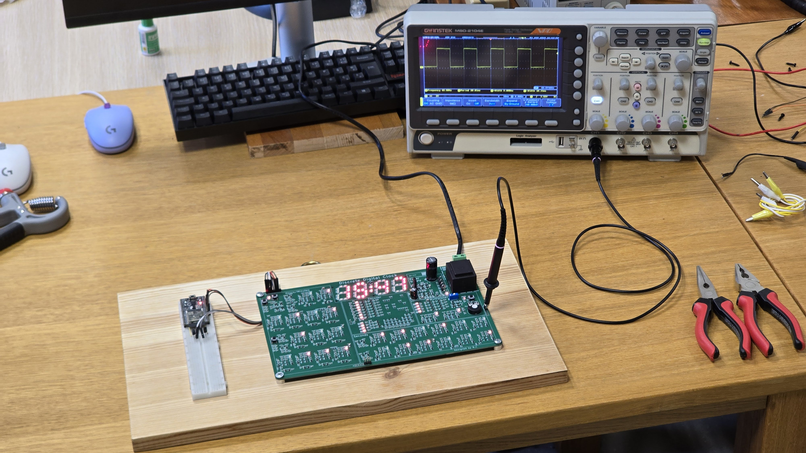
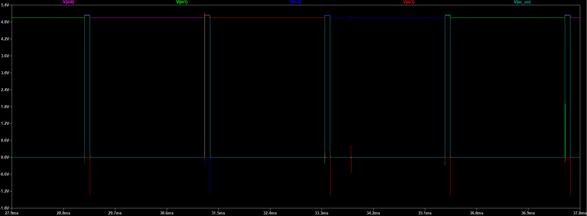
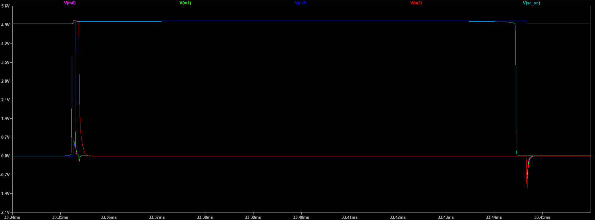
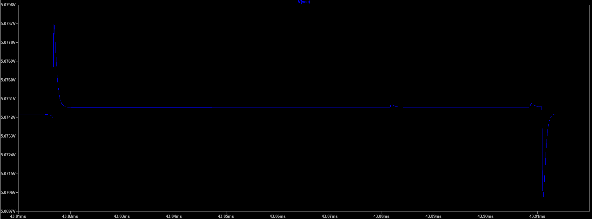
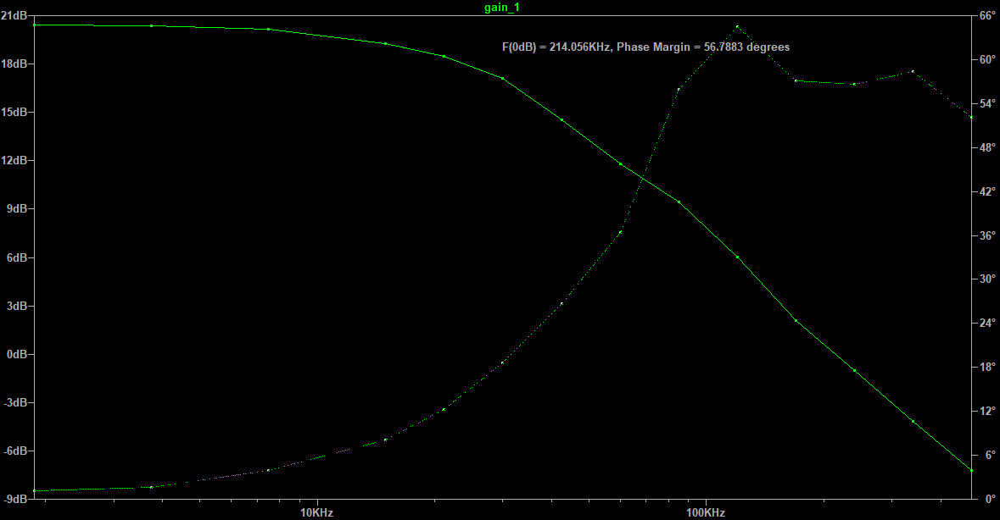
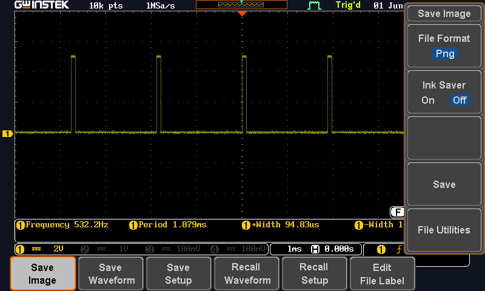
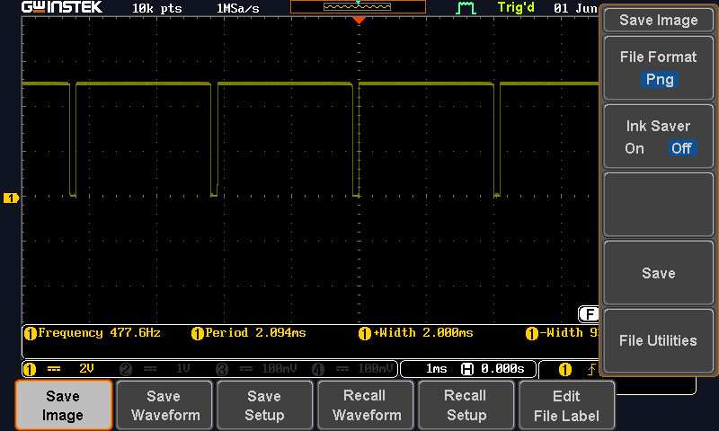

This page contains photos, oscilloscope screenshots, and short videos from the Discrete Digital Clock project.

### Finished clock

The finished Discrete Digital Clock mounted on the wall.

---

### 50 Hz signal

Oscilloscope capture of the 50 Hz reference signal from power-line.

Photo of the 50 Hz signal measurement during testing.

---

### Multiplexer signal (max brightness)

LTspice capture of the multiplexing signal used to switch between the display digits. This was not measured on the real circuit because I did not have enough oscilloscope probes. In the real circuit, it behaves similarly, but with much smaller spikes due to wire resistance, capacitance and inductance.

Signals M0, M1, M2, and M3 act as the power or enable outputs for the individual display digits. The SC_ON signal disables the currently active digit when it goes high and advances the multiplexer count. The next time SC_ON goes high, the next digit is enabled. During the disabled time, all transistors in the decoder and selector have enough time to settle and generate the correct signal before the next digit is turned on.

Close-up view of the multiplexer signal where it swiches.

<video controls muted width="100%" preload="metadata">
  <source src="/DDC-Manual/images/multiplexing_additional_cap.mp4" type="video/mp4">
  Your browser does not support the video tag.
</video>

Video showing the effect of adding an additional capacitor to the multiplexing signal to increase the delay.

---

### Power supply ripple

Oscilloscope capture showing ripple on the power supply during operation when all digits are 0. This little oscilation hapenes when miltiplexer swiches.

---

## Phase Margin Diagram

The linear drooper has a simulated phase margin of about **56°** at **200 mA**. It was tested from **0 mA to 500 mA** and remained stable across the full load range. The low-frequency loop gain is around **20 dB**, which is modest compared with common regulator ICs, but this circuit achieves it with only **six transistors** while keeping the dropout voltage low.

---

### PWM brightness control

PWM signal when the display brightness is set to maximum.

PWM signal when the display brightness is set to minimum.

---

### ESP32 Wi-Fi clock setter

<video controls muted width="100%" preload="metadata">
  <source src="/DDC-Manual/images/esp32_wifi_clock_setter.mp4" type="video/mp4">
  Your browser does not support the video tag.
</video>

This is ESP32 WiFi Clock Setter addon you can download code from [addons](https://github.com/blazjerman/DDC-Manual/tree/main/addons) folder. ESP32 sets the clock time when it boots by using the additional headers, which act like the hour and minute increment buttons.
